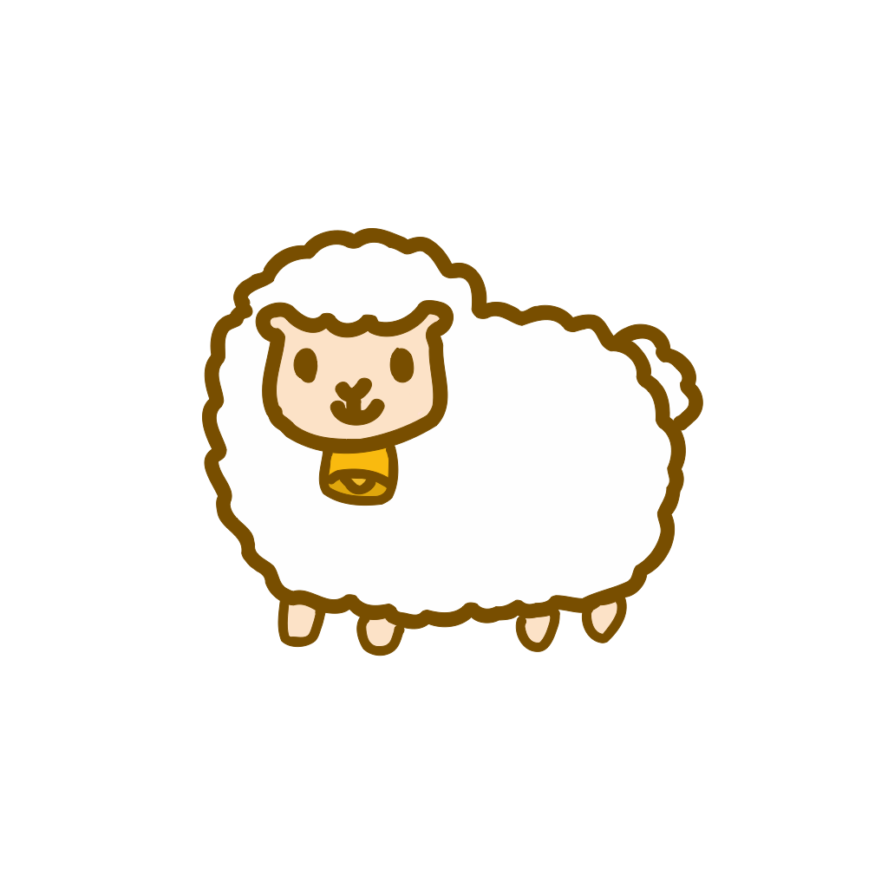
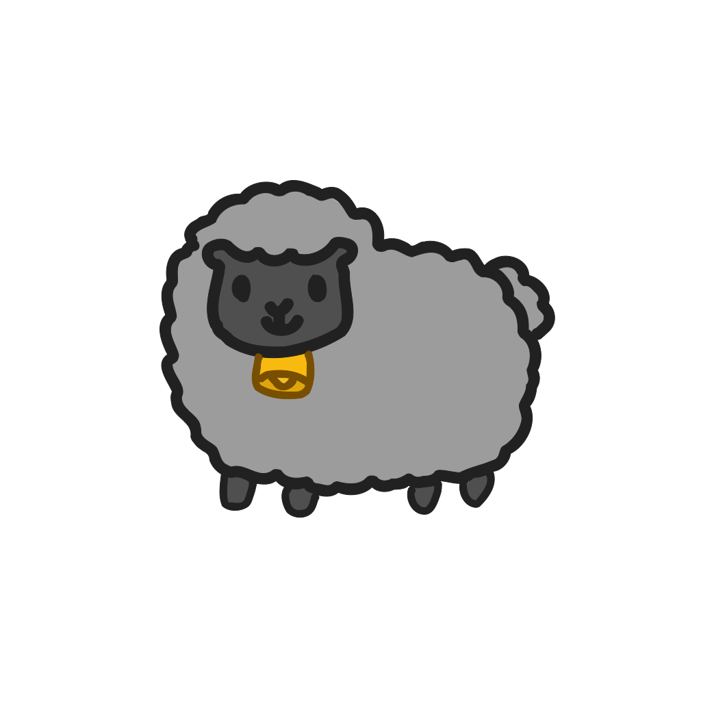

## Ranch The Sheep

Ranch The Sheep is an Android game application developed for the '*Sviluppo di Applicazioni Mobile*' course at University of Pisa.

### Gameplay

The game consists in catch the sheeps in a ranch. The player will compete against an opponent. In order to win, the player must catch all the sheeps  of a color (white or black).
To play with someone, two devices must be nearby, since the application uses WiFi Direct.

#### Thanks

I would like to thank the professor Vincenzo Gervasi for the course.
